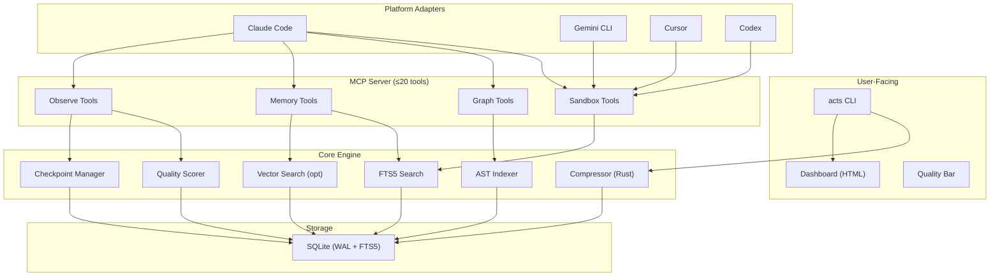

# awesome-claude-token-stack — Master Plan

> **Status**: PLAN ONLY — awaiting definitive approval before any implementation.
> **Date**: 2026-04-21
> **Author**: Research analysis of 10 upstream repositories

---

## 1. Executive Summary

This document is the result of a deep architectural investigation into 10 open-source projects that address token optimization, context management, and codebase intelligence for Claude Code and similar AI coding agents. After thoroughly analyzing each repository's source code, architecture, benchmarks, licensing, and integration models, this plan proposes a unified product called **awesome-claude-token-stack** that would be more complete, coherent, and powerful than all 10 upstream projects combined.

**Key findings:**

- The problem space naturally decomposes into 5 layers: **output compression**, **context sandboxing**, **codebase intelligence**, **persistent memory**, and **observability/diagnostics**
- No single upstream project covers all 5 layers well. RTK excels at output compression. Context-mode excels at sandboxing. Code-review-graph excels at structural intelligence. Token-savior has the most ambitious memory engine. Token-optimizer (alexgreensh) has the best observability
- Two projects have restrictive licenses that prevent code reuse: `context-mode` (ELv2) and `token-optimizer` (PolyForm Noncommercial)
- Most benchmark claims are self-reported and lack independent validation
- A clean-room redesign is needed, not a merge

---

## 2. Mission and Product Thesis

**Mission**: Build the definitive open-source toolkit for maximizing the effective intelligence and longevity of AI coding agent sessions by minimizing token waste, maximizing context quality, and providing full observability — all locally, without cloud dependencies.

**Product Thesis**: Coding agents get dumber as their context fills with noise. The solution is a composable stack that (1) compresses what enters context, (2) keeps raw data out of context via sandboxing, (3) provides structural intelligence so agents read only what matters, (4) persists knowledge across sessions, and (5) measures whether all of this actually works. No existing project does all five well.

---

## 3. Upstream Repositories Analyzed

| #   | Repo                                | Language      | License         | Stars (approx) | Primary Focus                                         |
| --- | ----------------------------------- | ------------- | --------------- | -------------- | ----------------------------------------------------- |
| 1   | `rtk-ai/rtk`                        | Rust          | Apache 2.0      | High           | CLI output filtering/compression                      |
| 2   | `mksglu/context-mode`               | TypeScript    | **ELv2**        | High           | Context sandboxing + session continuity               |
| 3   | `tirth8205/code-review-graph`       | Python        | MIT             | Medium         | Codebase knowledge graph + blast-radius               |
| 4   | `Mibayy/token-savior`               | Python        | MIT             | Medium         | Code navigation + persistent memory                   |
| 5   | `JuliusBrussee/caveman`             | Markdown/JS   | MIT             | High           | Output-style compression ("caveman speak")            |
| 6   | `drona23/claude-token-efficient`    | Markdown      | MIT             | Medium         | CLAUDE.md prompt optimization templates               |
| 7   | `ooples/token-optimizer-mcp`        | TypeScript    | MIT             | Medium         | MCP caching server with 65 tools                      |
| 8   | `nadimtuhin/claude-token-optimizer` | Bash/Markdown | MIT             | Low            | Doc structure optimization                            |
| 9   | `alexgreensh/token-optimizer`       | Python/TS     | **PolyForm NC** | Medium         | Observability + quality scoring + compaction survival |
| 10  | `zilliztech/claude-context`         | TypeScript    | MIT             | Medium         | Semantic code search via vector DB                    |

---

## 4. Per-Repo Deep Analysis

### 4.1 RTK (`rtk-ai/rtk`)

**What it does**: High-performance Rust CLI binary that wraps shell commands (git, cargo, npm, pytest, docker, etc.) and filters/compresses their output before it reaches the LLM context window.

**How it works**: A PreToolUse hook rewrites Bash commands (e.g., `git status` → `rtk git status`). RTK parses the command, runs it, applies filtering strategies (smart filtering, grouping, truncation, deduplication), and returns compressed output. Supports 100+ commands across 12+ language ecosystems.

**Unique strengths**:

- Single static Rust binary — <10ms overhead, no runtime dependencies
- 100+ command handlers with TOML-based extensibility (`src/filters/*.toml`)
- Auto-rewrite hook across 12 AI tools (Claude, Cursor, Gemini, Codex, Windsurf, etc.)
- Built-in analytics (`rtk gain`, `rtk discover`, `rtk session`)
- Tee system saves full raw output on failure for recovery
- Homebrew-distributed, production-grade CI/CD

**Weaknesses**:

- Only covers Bash tool calls; built-in Read/Grep/Glob bypass the hook
- No context sandboxing, no memory, no codebase intelligence
- Claims "60-90%" savings are estimated, not independently validated
- Telemetry opt-in system (well-designed but some users resistant)

**License**: Apache 2.0 — **fully permissive for reuse**

**Verdict**: Best-in-class output compression. The architectural pattern (hook → rewrite → filter → return) is excellent. Clean-room reimplementation of the approach is warranted; the TOML filter DSL concept is especially valuable.

---

### 4.2 Context Mode (`mksglu/context-mode`)

**What it does**: MCP server providing context sandboxing (raw data stays out of context), session continuity (SQLite event tracking survives compaction), and a "Think in Code" philosophy (agent writes scripts instead of ingesting data).

**How it works**: Six sandbox tools (`ctx_execute`, `ctx_batch_execute`, `ctx_execute_file`, `ctx_index`, `ctx_search`, `ctx_fetch_and_index`) plus hooks (PreToolUse, PostToolUse, PreCompact, SessionStart) across 12 platforms. FTS5 with BM25 ranking, porter stemming, trigram matching, RRF fusion, proximity reranking, fuzzy correction. SQLite knowledge base with 24h TTL cache.

**Unique strengths**:

- Most sophisticated session continuity system (4 hooks, per-platform adapters)
- Multi-platform support: Claude Code, Gemini CLI, Cursor, VS Code Copilot, OpenCode, KiloCode, OpenClaw, Codex, Antigravity, Kiro, Zed, Pi
- FTS5 + BM25 + RRF hybrid search with smart snippets
- Progressive throttling to prevent search abuse
- "Think in Code" paradigm — 11 language runtimes in sandbox
- Mature adapter architecture (`src/adapters/`) for each platform

**Weaknesses**:

- **ELv2 license** — cannot be offered as a hosted service; derivative works must preserve notices
- Complex installation (npm global + hooks + per-platform config)
- No codebase structural intelligence (no AST, no call-graph)
- No output compression (delegates to RTK for that)
- Heavy dependency on better-sqlite3 / node:sqlite

**License**: **Elastic License v2 (ELv2)** — ⚠️ **Cannot provide as hosted/managed service. Code reuse requires careful legal analysis. Clean-room reimplementation strongly recommended.**

**Verdict**: Best session continuity and sandboxing. The adapter pattern for multi-platform support is the right approach. Must be clean-room reimplemented due to ELv2.

---

### 4.3 Code Review Graph (`tirth8205/code-review-graph`)

**What it does**: Builds a structural AST-based graph of a codebase using Tree-sitter, stores it in SQLite, and provides MCP tools for blast-radius analysis, semantic search, code navigation, and review assistance.

**How it works**: Parses source files with Tree-sitter into nodes (functions, classes, imports) and edges (calls, inheritance, test coverage). Stores in SQLite with FTS5. 28 MCP tools for querying the graph. Incremental updates via SHA-256 hash checks. Optional vector embeddings via sentence-transformers, Google Gemini, or OpenAI-compatible endpoints.

**Unique strengths**:

- 23 language support including Jupyter/Databricks notebooks
- Blast-radius analysis (100% recall in benchmarks)
- Community detection via Leiden algorithm
- Execution flow tracing with weighted criticality
- Hub & bridge detection (betweenness centrality)
- Surprise scoring for unexpected coupling
- Multi-repo registry
- D3.js interactive visualization
- Export to GraphML, Neo4j Cypher, Obsidian vault, SVG
- Honest benchmark with known weaknesses documented
- VSCode extension with webview

**Weaknesses**:

- Python-only (slower than Rust for large codebases)
- MRR 0.35 for search quality (acknowledged)
- Flow detection only 33% recall (acknowledged)
- No output compression, no session continuity
- No memory persistence
- Graph building takes ~10s for 500 files (acceptable but not instant)

**License**: MIT — **fully permissive**

**Verdict**: Best codebase intelligence / knowledge graph. The Tree-sitter + SQLite + MCP pattern is solid. Concepts should be preserved; reimplementation in a faster language (Rust or optimized Python) is desirable.

---

### 4.4 Token Savior (`Mibayy/token-savior`)

**What it does**: Dual-purpose MCP server combining (1) structural code navigation (105 tools for symbol lookup, call graphs, dependency analysis) with (2) a persistent memory engine (SQLite WAL + FTS5 + vector embeddings, Bayesian validity, contradiction detection, decay/TTL).

**How it works**: Indexes codebase by symbol — functions, classes, imports, call graph — using language-specific annotators (Python, TypeScript, Rust, Go, Java, C#, C, TOML, YAML, JSON, XML, Docker, etc.). Memory engine stores 12 observation types with progressive disclosure (3-layer: `memory_index` → `memory_search` → `memory_get`). Hooks for Claude Code lifecycle. Citation URIs (`ts://obs/{id}`).

**Unique strengths**:

- 105 MCP tools (largest tool surface of any project)
- Progressive disclosure contract for memory (15/60/200 tokens per layer)
- Bayesian validity scoring on observations
- Contradiction detection at save time
- MDL distillation (Minimum Description Length grouping)
- Auto-promotion (note ×5 accesses → convention)
- Symbol staleness via content-hash linking
- ROI tracking (access count × context weight)
- Profiles system (`full`/`core`/`nav`/`lean`/`ultra`) to control tool manifest size
- Extensive test suite (1318 tests)
- Language-specific annotators for 15+ languages
- Session warmstart and checkpoint ops

**Weaknesses**:

- Massive tool surface (105 tools) creates significant MCP manifest overhead
- Python-only, heavy dependency chain
- Memory engine complexity may be over-engineered for many use cases
- Benchmark (tsbench) is self-authored, not independently validated
- No output compression
- No context sandboxing
- Web viewer is opt-in and basic (htmx + SSE)

**License**: MIT — **fully permissive**

**Verdict**: Most ambitious memory engine and deepest code navigation. The progressive disclosure pattern and Bayesian validity concepts are excellent. The 105-tool surface is a design concern that needs addressing (tool manifest consumes context tokens).

---

### 4.5 Caveman (`JuliusBrussee/caveman`)

**What it does**: A "skill" / plugin that instructs the AI to respond in compressed, telegram-style prose ("caveman speak"), reducing output tokens by ~75% while preserving technical accuracy. Also includes a `caveman-compress` tool that compresses CLAUDE.md and similar files.

**How it works**: SKILL.md prompt injection at session start. Intensity levels: Lite, Full, Ultra, 文言文 (Wenyan). Hook-based auto-activation on Claude Code. `caveman-compress` rewrites prose portions of markdown files while preserving code blocks, URLs, and technical content.

**Unique strengths**:

- Simple, elegant concept — zero runtime requirements
- Multi-platform: Claude Code, Codex, Gemini CLI, Cursor, Windsurf, Cline, Copilot
- Input compression via `caveman-compress` (46% average on CLAUDE.md files)
- Well-designed eval harness (3-arm: verbose vs terse vs skill)
- Backed by research (arXiv:2604.00025 on brevity constraints)
- Fun branding and community engagement

**Weaknesses**:

- Only affects output tokens (thinking tokens untouched)
- No caching, no memory, no codebase intelligence, no observability
- Savings highly variable (22%-87% across prompts)
- May reduce readability for humans (trade-off)
- Compression tool is basic (regex-based prose rewriting)

**License**: MIT — **fully permissive**

**Verdict**: Clever and effective for output compression. The concept is sound but narrow. The `caveman-compress` input compression idea is worth incorporating. The terse-response skill pattern should be one mode in a larger system.

---

### 4.6 Claude-Token-Efficient (`drona23/claude-token-efficient`)

**What it does**: A curated CLAUDE.md file with rules that reduce Claude's verbosity, sycophancy, and over-engineering. Includes profiles for different use cases (coding, automation, analysis, benchmarks) and versioned optimization strategies.

**How it works**: Drop a CLAUDE.md file in your project root. Rules instruct Claude to think before coding, be concise, avoid flattery, prefer targeted edits, test before finishing. Profiles adjust intensity. Based on real community complaints and bug reports.

**Unique strengths**:

- Zero-dependency, zero-setup approach
- Well-researched rules based on actual Claude failure modes
- External benchmark validation (Issue #1 — 17.4% cost reduction on 3 coding challenges)
- Versioned configs (v5, v6, v8) with different trade-off strategies
- Honest about limitations (input token overhead, net savings only at scale)
- Composable with Claude's multi-level CLAUDE.md loading

**Weaknesses**:

- Not a tool — just a markdown file with rules
- No enforcement mechanism (model may ignore rules)
- Rules consume input tokens on every message
- No persistence, no caching, no intelligence
- Cannot adapt dynamically to session state

**License**: MIT — **fully permissive**

**Verdict**: Good base-level optimization that every project should include. The rules should be incorporated as the "prompt optimization" module of the larger system. The approach of version profiles is smart.

---

### 4.7 Token Optimizer MCP (`ooples/token-optimizer-mcp`)

**What it does**: An MCP server providing 65 tools for caching, compression, and smart file/API/database operations. Uses Brotli compression, SQLite caching, tiktoken for counting, and a 7-phase hook optimization pipeline.

**How it works**: Global hooks intercept every tool call. PreToolUse replaces standard tools (Read → smart_read, Grep → smart_grep, etc.) with optimized versions that cache results and return diffs on re-reads. PostToolUse compresses large outputs. SQLite + Brotli for persistent caching. Multi-tier LRU/LFU/FIFO cache system.

**Unique strengths**:

- Comprehensive tool replacement strategy (smart_read, smart_grep, smart_glob, etc.)
- Multi-tier caching (L1/L2/L3) with 6 eviction strategies
- Brotli compression (up to 82x for repetitive content)
- Token analytics (per-hook, per-action, per-MCP-server tracking)
- Cache warmup, predictive caching, cache replication concepts
- Auto-installer for multiple platforms
- Dashboard monitoring tools

**Weaknesses**:

- 65 tools is very large (manifest overhead)
- Many "smart\_\*" tools are thin wrappers — questionable real-world value
- Some tools seem aspirational (ML-based predictive caching, ARIMA/LSTM — unlikely to be production-ready)
- Hook overhead was initially 50-70ms (optimized to <10ms)
- PowerShell-focused hook implementation (Windows bias)
- No codebase intelligence, no memory
- Build system tools (smart_build, smart_test) overlap with RTK's domain

**License**: MIT — **fully permissive**

**Verdict**: Good caching concepts but over-engineered tool surface. The multi-tier cache architecture and delta-diff approach for re-reads are solid ideas. The monitoring/analytics tools should be consolidated. Many "smart\_\*" wrappers should be pruned.

---

### 4.8 Claude Token Optimizer (`nadimtuhin/claude-token-optimizer`)

**What it does**: A bash script that creates an optimized documentation structure for Claude, reducing startup token consumption from ~11K to ~800 tokens by structuring docs into "always loaded" (4 core files) and "on demand" (everything else via .claudeignore).

**How it works**: `init.sh` creates a directory structure with CLAUDE.md → 4 core files → learnings directory → archive directory. Framework-specific templates for 9 frameworks (Express, Next.js, Vue, etc.). Uses `.claudeignore` to prevent auto-loading of historical docs.

**Unique strengths**:

- Simplest approach — just file organization
- Framework-specific mistake templates
- `.claudeignore` is a clever use of Claude's native feature
- Honest about scope (just doc optimization)
- Interactive setup script

**Weaknesses**:

- Extremely narrow scope (just doc structure)
- No tooling, no automation, no intelligence
- Manual maintenance burden
- `.claudeignore` approach depends on Claude's implementation details
- No benchmarks beyond one personal project
- Not actively maintained (limited recent activity)

**License**: MIT — **fully permissive**

**Verdict**: Good idea, minimal scope. The principle of "load only what's needed" is correct but should be automated rather than requiring manual doc organization. The framework-specific mistake templates are reusable content.

---

### 4.9 Token Optimizer (`alexgreensh/token-optimizer`)

**What it does**: The most comprehensive observability and diagnostics suite for Claude Code sessions. Provides quality scoring (7-signal metric), compaction survival (progressive checkpoints), active compression (delta mode, bash compression, loop detection, quality nudges), a live dashboard, coach mode, fleet auditing, and MEMORY.md/CLAUDE.md health analysis.

**How it works**: Runs as an external Python process (zero context tokens consumed). Hooks into Claude Code lifecycle (SessionStart, SessionEnd, PreToolUse, PostToolUse, PreCompact, UserPromptSubmit). Writes all data to local SQLite (`trends.db`). Dashboard is a single-file HTML served via localhost. Quality score computed from 7 weighted signals. Progressive checkpoints at 20/35/50/65/80% context fill. Tool result archiving with inline hints for model-driven retrieval.

**Unique strengths**:

- Best observability of any project (per-turn token breakdown, cache analysis, pacing metrics, cost across 4 pricing tiers)
- 7-signal quality scoring with efficiency grades (S/A/B/C/D/F)
- Progressive checkpoints (not just emergency compaction)
- Tool result archiving with model-aware retrieval (`expand` command)
- Coach mode with 9 waste detectors
- Fleet auditor for multi-agent systems
- CLAUDE.md attention-curve optimization
- MEMORY.md structural health audit
- Delta mode for smart re-reads (97% savings on individual re-reads)
- Bash compression (16 command handlers)
- Loop detection (catches retry loops before token burn)
- Zero runtime dependencies (pure Python stdlib)
- Zero telemetry, zero network calls
- OpenClaw plugin (TypeScript, separate from Python Claude Code version)
- Honest comparison table against competitors
- Cache-safety analysis (never breaks prompt cache)

**Weaknesses**:

- **PolyForm Noncommercial license** — ⚠️ **Cannot be used commercially without paid license. Code reuse prohibited for commercial purposes.**
- Python + Node.js dual runtime (separate implementations for Claude Code vs OpenClaw)
- Complex setup (`measure.py` with many subcommands)
- Only supports Claude Code and OpenClaw (Cursor/Windsurf planned)
- Dashboard is auto-generated HTML (functional but not beautiful)
- Some features are measurement-only (Structure Map Beta)

**License**: **PolyForm Noncommercial 1.0.0** — ⚠️ **Cannot be used for any commercial purpose. Clean-room reimplementation required for any features we want.**

**Verdict**: Best observability and quality measurement. The 7-signal scoring, progressive checkpoints, and tool result archiving concepts are excellent. Must be entirely clean-room reimplemented due to license restrictions. The cache-safety principle (never modify content already in context) is an important architectural constraint.

---

### 4.10 Claude Context (`zilliztech/claude-context`)

**What it does**: MCP plugin for semantic code search using vector embeddings. Indexes codebase into Zilliz Cloud (Milvus) vector database with AST-based chunking and hybrid search (BM25 + dense vector).

**How it works**: Monorepo with three packages: core (indexing engine), MCP server, VSCode extension + Chrome extension. Uses Merkle trees for incremental indexing. AST-based code chunking via tree-sitter (with langchain fallback). Supports OpenAI, VoyageAI, Ollama, and Gemini embedding providers. Hybrid BM25 + dense vector search.

**Unique strengths**:

- Professional engineering (Zilliz is a commercial company behind Milvus)
- Hybrid search (BM25 + dense vector) is current best practice
- AST-based code chunking with tree-sitter
- Incremental indexing via Merkle trees
- Multi-embedding-provider support
- VSCode extension with visual interface
- Chrome extension for browser-based search
- Evaluation framework with case studies
- Broad MCP client support

**Weaknesses**:

- **Requires external cloud service** (Zilliz Cloud) — not local-first
- OpenAI API key required for embeddings — additional cost and dependency
- Only 4 MCP tools (limited surface)
- No output compression, no session continuity, no memory
- No CLAUDE.md optimization, no observability
- ~40% token reduction claimed (modest compared to others)
- Heavy monorepo with pnpm workspace complexity

**License**: MIT — **fully permissive**

**Verdict**: Best embedding/vector infrastructure with professional engineering. The hybrid search and AST chunking are valuable. However, the cloud dependency (Zilliz) is a concern. A local-first alternative (SQLite-vec, in-process embeddings) should be the default, with optional cloud backends for scale.

---

## 5. Cross-Repo Feature Matrix

| Capability                    | RTK | ctx-mode | CRG | TkSavior | Caveman | CL-eff | TkOpt-MCP | CL-TkOpt | TkOpt(AG) | CL-ctx |
| ----------------------------- | :-: | :------: | :-: | :------: | :-----: | :----: | :-------: | :------: | :-------: | :----: |
| Output compression            | ★★★ |    —     |  —  |    —     |   ★★    |   ★    |     ★     |    —     |    ★★     |   —    |
| Context sandboxing            |  —  |   ★★★    |  —  |    —     |    —    |   —    |     ★     |    —     |     —     |   —    |
| Codebase intelligence         |  —  |    —     | ★★★ |   ★★★    |    —    |   —    |     ★     |    —     |     ★     |   ★★   |
| Persistent memory             |  —  |    ★★    |  ★  |   ★★★    |    —    |   —    |     —     |    —     |     —     |   —    |
| Session continuity            |  —  |   ★★★    |  —  |    ★     |    —    |   —    |     —     |    —     |    ★★★    |   —    |
| Observability                 | ★★  |    ★     |  ★  |    ★     |    —    |   —    |    ★★     |    —     |    ★★★    |   —    |
| Prompt/CLAUDE.md optimization |  —  |    —     |  —  |    —     |   ★★    |  ★★★   |     —     |    ★     |    ★★     |   —    |
| Semantic search               |  —  |    ★★    | ★★  |    ★★    |    —    |   —    |     —     |    —     |     —     |  ★★★   |
| Multi-platform support        | ★★★ |   ★★★    | ★★  |    ★     |   ★★★   |   ★    |    ★★     |    ★     |     ★     |  ★★★   |
| Local-first / no cloud        | ★★★ |   ★★★    | ★★★ |   ★★★    |   ★★★   |  ★★★   |    ★★★    |   ★★★    |    ★★★    |   ✗    |
| Benchmark credibility         | ★★  |    ★★    | ★★★ |    ★★    |   ★★    |   ★★   |     ★     |    ★     |    ★★     |   ★★   |

Legend: ★★★ = Excellent, ★★ = Good, ★ = Basic, — = Not present, ✗ = Depends on external service

---

## 6. Overlap, Gaps, and Contradictions

### Major Overlaps

- **Output compression**: RTK, Caveman, token-optimizer (AG's bash_compress), and token-optimizer-mcp all compress CLI output with different approaches
- **File caching/deduplication**: token-optimizer-mcp's smart_read, token-optimizer (AG)'s delta mode, and context-mode's sandbox all prevent redundant file reads
- **FTS5 search**: context-mode, code-review-graph, and token-savior all use SQLite FTS5 with BM25
- **Session continuity**: context-mode and token-optimizer (AG) both solve compaction survival with different strategies
- **CLAUDE.md optimization**: claude-token-efficient, caveman-compress, and token-optimizer (AG)'s attention-score all optimize the instruction file

### Major Gaps (not well-covered by any project)

1. **Unified benchmark/evaluation framework** — every project has its own, none are comparable
2. **Cross-project context sharing** — working across multiple repositories intelligently
3. **Automated context budget management** — dynamically deciding what stays in and what goes out
4. **Streaming/real-time output compression** — most solutions are batch, not streaming
5. **Cost prediction** — estimating session cost before starting
6. **Agent coordination protocol** — for multi-agent scenarios with shared context
7. **Context visualization** — what's actually in the context window right now

### Key Contradictions

- **Tool count philosophy**: Token-savior (105 tools) vs RTK (0 MCP tools, just a CLI) — tool manifest size is itself a context cost
- **Cloud vs local**: Claude-context requires Zilliz Cloud; all others are local-first — we should be local-first with optional cloud
- **Compression approach**: RTK rewrites commands at the shell level; token-optimizer-mcp replaces at the MCP level; caveman compresses the model's _response_ — these are complementary, not competing
- **License ideology**: Most are MIT; context-mode is ELv2; token-optimizer is PolyForm NC — unified project must be MIT or Apache 2.0

---

## 7. What We Should Borrow, Rebuild, or Avoid

### Borrow (Concepts to Preserve)

| Concept                                           | Source               | Why                                                    |
| ------------------------------------------------- | -------------------- | ------------------------------------------------------ |
| TOML-based filter definitions for CLI commands    | RTK                  | Extensible, declarative, community-contributed         |
| Adapter pattern for multi-platform support        | Context-mode         | Clean separation of platform-specific logic            |
| Tree-sitter AST-based structural graph            | Code-review-graph    | Best approach for cross-language code intelligence     |
| Progressive disclosure 3-layer memory search      | Token-savior         | Excellent token-budget-aware information retrieval     |
| 7-signal quality scoring with grades              | Token-optimizer (AG) | Best observability metric design                       |
| Progressive checkpoints (not just emergency)      | Token-optimizer (AG) | Smarter compaction survival strategy                   |
| Tool result archiving with model-driven retrieval | Token-optimizer (AG) | Elegant solution for large tool outputs                |
| Hybrid BM25 + vector search                       | Claude-context / CRG | Current best practice for code search                  |
| "Think in Code" sandbox philosophy                | Context-mode         | Fundamental insight about context management           |
| Terse response skill with intensity levels        | Caveman              | Simple, effective output compression with user control |
| CLAUDE.md attention-curve optimization            | Token-optimizer (AG) | Novel insight about positional attention in prompts    |

### Rebuild (Clean-Room Reimplementation Required)

| Capability                        | Reason                               |
| --------------------------------- | ------------------------------------ |
| All context-mode features         | ELv2 license prohibits direct reuse  |
| All token-optimizer (AG) features | PolyForm NC prohibits commercial use |
| Session continuity system         | Must be license-clean                |
| Quality scoring system            | Must be license-clean                |
| Dashboard / analytics             | Must be license-clean                |

### Avoid (Explicitly Exclude)

| What                                         | Source                            | Why                                                                      |
| -------------------------------------------- | --------------------------------- | ------------------------------------------------------------------------ |
| 100+ MCP tool surfaces                       | Token-savior, Token-optimizer-mcp | Tool manifest overhead consumes context tokens; use fewer, smarter tools |
| Cloud-required vector DB                     | Claude-context                    | Violates local-first principle                                           |
| ML-based predictive caching (ARIMA/LSTM)     | Token-optimizer-mcp               | Over-engineered; simple LRU/TTL is sufficient                            |
| "Smart" wrappers for API/DB/build operations | Token-optimizer-mcp               | Scope creep; those are application concerns, not token optimization      |
| Telemetry systems                            | RTK                               | Privacy concern; keep all data strictly local                            |
| 文言文 mode                                  | Caveman                           | Novelty; not practical for most users                                    |

---

## 8. Licensing / Reuse / Compliance Risks

| Repo                   | License         | Can We Reuse Code?                                                    | Can We Reuse Concepts?               | Risk Level |
| ---------------------- | --------------- | --------------------------------------------------------------------- | ------------------------------------ | ---------- |
| RTK                    | Apache 2.0      | Yes (with attribution + NOTICE)                                       | Yes                                  | 🟢 Low     |
| Context-mode           | **ELv2**        | **No** (cannot offer as hosted service; derivative work restrictions) | Yes (concepts are not copyrightable) | 🔴 High    |
| Code-review-graph      | MIT             | Yes                                                                   | Yes                                  | 🟢 Low     |
| Token-savior           | MIT             | Yes                                                                   | Yes                                  | 🟢 Low     |
| Caveman                | MIT             | Yes                                                                   | Yes                                  | 🟢 Low     |
| Claude-token-efficient | MIT             | Yes                                                                   | Yes                                  | 🟢 Low     |
| Token-optimizer-mcp    | MIT             | Yes                                                                   | Yes                                  | 🟢 Low     |
| Claude-token-optimizer | MIT             | Yes                                                                   | Yes                                  | 🟢 Low     |
| Token-optimizer (AG)   | **PolyForm NC** | **No** (prohibits commercial use)                                     | Yes (concepts are not copyrightable) | 🔴 High    |
| Claude-context         | MIT             | Yes                                                                   | Yes                                  | 🟢 Low     |

**Strategy**: All implementation must be clean-room for any feature inspired by context-mode or token-optimizer (AG). Never copy code from those two projects. Document the conceptual inspiration with clean-room development process.

---

## 9. Proposed Unified Product Vision

**awesome-claude-token-stack** is a modular, local-first, MIT-licensed toolkit for maximizing AI coding agent effectiveness through five composable layers:

```
┌─────────────────────────────────────────────────────────────┐
│                    awesome-claude-token-stack                 │
├─────────────────────────────────────────────────────────────┤
│ Layer 5: OBSERVABILITY                                       │
│   Quality scoring · Dashboard · Cost tracking · Benchmarks   │
├─────────────────────────────────────────────────────────────┤
│ Layer 4: MEMORY                                              │
│   Persistent knowledge · Session continuity · Decay/TTL      │
├─────────────────────────────────────────────────────────────┤
│ Layer 3: INTELLIGENCE                                        │
│   AST graph · Blast radius · Semantic search · Symbol nav    │
├─────────────────────────────────────────────────────────────┤
│ Layer 2: SANDBOX                                             │
│   Script execution · Off-context storage · FTS5 index        │
├─────────────────────────────────────────────────────────────┤
│ Layer 1: COMPRESSION                                         │
│   CLI output filtering · Terse mode · CLAUDE.md optimization │
├─────────────────────────────────────────────────────────────┤
│ Foundation: PLATFORM ADAPTERS + HOOKS                        │
│   Claude Code · Gemini CLI · Cursor · VS Code Copilot · ...  │
└─────────────────────────────────────────────────────────────┘
```

**Key Design Principles**:

1. **Composable** — install any layer independently; they enhance each other but don't require each other
2. **Local-first** — no cloud dependencies required; cloud backends optional for scale
3. **Cache-safe** — never modify content already in context (prompt cache preservation)
4. **Observable** — every optimization is measurable; never trust claims without data
5. **Minimal context cost** — the toolkit itself should consume minimal context tokens
6. **Multi-platform** — works across Claude Code, Gemini CLI, Cursor, Codex, and more

---

## 10. Proposed System Architecture

```
                          ┌──────────────────┐
                          │   Agent / IDE    │
                          └──────┬───────────┘
                                 │
                    ┌────────────┴────────────┐
                    │    Platform Adapter      │
                    │  (hooks + MCP bridge)    │
                    └────────────┬────────────┘
                                 │
           ┌─────────────┬───────┴───────┬──────────────┐
           │             │               │              │
    ┌──────┴─────┐ ┌─────┴──────┐ ┌──────┴─────┐ ┌─────┴──────┐
    │ Compressor │ │  Sandbox   │ │  Indexer   │ │  Observer  │
    │   (Rust)   │ │   (MCP)    │ │ (AST+Vec)  │ │ (Analytics)│
    └──────┬─────┘ └─────┬──────┘ └──────┬─────┘ └─────┬──────┘
           │             │               │              │
           └─────────────┴───────┬───────┴──────────────┘
                                 │
                    ┌────────────┴────────────┐
                    │    Storage Layer         │
                    │  SQLite (WAL + FTS5 +    │
                    │   sqlite-vec optional)   │
                    └─────────────────────────┘
```

**Components**:

- **Platform Adapter**: Per-agent hooks and MCP registration. Detects agent at runtime. Provides PreToolUse, PostToolUse, PreCompact, SessionStart hooks
- **Compressor**: Rust binary for CLI output filtering (RTK-style). TOML-defined filters. <10ms overhead
- **Sandbox**: MCP server for off-context script execution, URL fetching, and batch operations. Returns only stdout/results
- **Indexer**: AST-based codebase graph (Tree-sitter) + optional vector embeddings (in-process, no cloud). Incremental updates via content hashing
- **Observer**: Quality scoring, session tracking, cost analytics, checkpoint management. External process (zero context cost)
- **Storage**: Unified SQLite database with WAL mode, FTS5 for text search, sqlite-vec for optional vectors, and structured tables for memory/observations

---

## 11. Core Modules

### 11.1 `@acts/adapter` — Platform Adapter Layer

- Agent auto-detection (Claude Code, Gemini CLI, Cursor, Codex, VS Code Copilot, OpenCode, Windsurf, Kiro, Zed)
- Hook registration (PreToolUse, PostToolUse, PreCompact, SessionStart, SessionEnd, UserPromptSubmit)
- MCP server with unified tool registration
- Routing enforcement and tool interception
- **Implementation**: TypeScript (for MCP SDK compatibility)
- **Est. complexity**: Medium

### 11.2 `@acts/compress` — Output Compression Engine

- CLI output filtering for 50+ command families (git, cargo, npm, pytest, docker, etc.)
- TOML-based filter DSL for extensibility
- Terse-response skill injection (3 intensity levels)
- CLAUDE.md compression and attention-curve optimization
- Tee system for raw output recovery on failures
- **Implementation**: Rust binary (performance-critical path) + TypeScript wrappers
- **Est. complexity**: High

### 11.3 `@acts/sandbox` — Context Sandbox

- Off-context script execution (JS, Python, Shell, Go, Rust — 6 runtimes minimum)
- Batch operation support (multiple commands/queries in one call)
- URL fetch-and-index with TTL caching
- FTS5 knowledge base with BM25 + porter stemming + trigram substring
- Intent-driven filtering for large outputs
- Progressive throttling
- **Implementation**: TypeScript (MCP server)
- **Est. complexity**: High

### 11.4 `@acts/graph` — Codebase Intelligence

- Tree-sitter AST parsing (15+ languages minimum)
- Structural graph (nodes: functions/classes/imports; edges: calls/inheritance/tests)
- Blast-radius analysis (callers, dependents, tests affected by changes)
- Incremental updates via content-hash diffing
- Community detection (Leiden algorithm)
- SQLite storage with FTS5 for symbol search
- **Implementation**: Python initially (leverage tree-sitter bindings), potential Rust port
- **Est. complexity**: Very High

### 11.5 `@acts/memory` — Persistent Memory Engine

- Observation types (decision, bugfix, convention, guardrail, note, warning, etc.)
- FTS5 + optional sqlite-vec for hybrid search
- Progressive disclosure (3-layer: index → search → get)
- Decay/TTL per observation type
- Content-hash linking for symbol staleness detection
- Session rollup and warmstart
- Citation URIs for agent-native references
- **Implementation**: TypeScript
- **Est. complexity**: High

### 11.6 `@acts/observe` — Observability & Quality

- Quality scoring (7-signal weighted metric: context fill, stale reads, bloated results, compaction depth, duplicates, decision density, agent efficiency)
- Efficiency grades (S/A/B/C/D/F)
- Progressive checkpoint system (capture at 20/35/50/65/80% context fill)
- Session continuity (snapshot → serialize → restore after compaction)
- Tool result archiving with model-driven retrieval
- Cost tracking across pricing tiers
- Live status bar integration
- **Implementation**: TypeScript (external process, zero context cost)
- **Est. complexity**: High

---

## 12. Optional / Advanced Modules

### 12.1 `@acts/dashboard` — Visual Analytics

- Single-file HTML dashboard (self-contained, no build step)
- Per-turn token breakdown, cache analysis, cost tracking
- Quality score history, degradation bands
- Subagent cost breakdown
- Session drill-down
- Savings tracker
- Auto-update after each session
- **Complexity**: Medium | **Priority**: V2

### 12.2 `@acts/coach` — Proactive Optimization

- Waste pattern detectors (loop, retry churn, overpowered model, bad decomposition, etc.)
- Actionable recommendations with token-savings estimates
- CLAUDE.md / MEMORY.md structural audit
- Model routing suggestions based on task complexity
- **Complexity**: Medium | **Priority**: V2

### 12.3 `@acts/vector` — Vector Search Backend

- In-process embedding generation (ONNX Runtime + MiniLM)
- sqlite-vec for local vector storage
- Optional cloud backends (OpenAI, Ollama, Voyage) for embedding generation
- Hybrid BM25 + dense vector search with RRF fusion
- **Complexity**: High | **Priority**: V2

### 12.4 `@acts/viz` — Code Visualization

- D3.js force-directed graph
- Community-colored clusters
- Interactive exploration
- Export to GraphML, SVG, Obsidian vault
- **Complexity**: Medium | **Priority**: V3

### 12.5 `@acts/fleet` — Multi-Agent Fleet Management

- Cross-agent config auditing
- Idle burn detection
- Model misrouting detection
- Unified cost reporting across agents
- **Complexity**: Medium | **Priority**: V3

---

## 13. Data, Memory, Cache, and Indexing Strategy

### Unified Storage: SQLite + WAL + FTS5

All persistent data lives in a single SQLite database per project at `.acts/store.db` with WAL mode:

```sql
-- Core tables
sessions          -- session lifecycle events
observations      -- persistent memory (decisions, conventions, etc.)
checkpoints       -- compaction survival snapshots
tool_results      -- archived large tool outputs

-- FTS5 virtual tables
observations_fts  -- full-text search on memory
content_fts       -- indexed content (URLs, docs, etc.)
symbols_fts       -- code symbol search

-- Graph tables
nodes             -- AST nodes (functions, classes, imports)
edges             -- relationships (calls, inherits, tests)
node_hashes       -- content hashes for incremental updates

-- Analytics tables
turn_metrics      -- per-turn token counts and costs
quality_scores    -- quality score history
compression_events -- measured savings from each feature
```

### Cache Strategy

- **L1 (In-memory)**: LRU cache for hot file content and recent search results. Bounded to 50MB
- **L2 (SQLite)**: Persistent cache with TTL-based expiration. Brotli-compressed values
- **No L3**: Keep it simple. Two tiers are sufficient for local operation

### Indexing Strategy

- **Incremental**: Content-hash (SHA-256) based change detection. Only re-parse changed files
- **Async**: Indexing runs in a background worker, never blocks the main MCP server
- **Bounded**: Maximum 100K nodes in the graph. Warn on larger codebases, suggest `.actsignore`

---

## 14. Retrieval and Search Strategy

Three complementary search paths:

1. **Symbol search** (exact): AST-indexed functions, classes, imports. Instant lookup by name
2. **Text search** (FTS5): BM25 with porter stemming + trigram substring. RRF fusion of both strategies. Fuzzy correction via Levenshtein distance
3. **Vector search** (optional): Dense embeddings for semantic similarity. sqlite-vec for local storage. Hybrid with FTS5 via RRF

**Progressive disclosure** for all search:

- Layer 1 (index): ~15 tokens/result — names, types, locations
- Layer 2 (summary): ~60 tokens/result — signatures, brief context
- Layer 3 (full): ~200 tokens/result — complete source, documentation

---

## 15. Compression / Token-Saving Strategy

Five complementary approaches, each independently toggleable:

| Approach                   | Where                | Savings              | Risk                            |
| -------------------------- | -------------------- | -------------------- | ------------------------------- |
| **CLI output filtering**   | Shell command output | 60-90%               | Low (lossy for verbose output)  |
| **Terse response mode**    | Model output         | 50-75%               | Low (user-controlled intensity) |
| **Smart re-reads**         | File reading         | 80-97% (on re-reads) | Low (falls back to full read)   |
| **Context sandboxing**     | Large data ingestion | 95-98%               | None (data still accessible)    |
| **CLAUDE.md optimization** | Startup overhead     | 30-60%               | Low (original preserved)        |

**Cache safety guarantee**: We NEVER modify content already in the conversation context. All compression works on _new_ content entering the window or on _structural_ artifacts (CLAUDE.md, MEMORY.md) between sessions. Prompt cache integrity is preserved.

---

## 16. Observability and Context-Health Strategy

### Quality Score (7 signals, 100-point scale)

| Signal                                  | Weight | Source                      |
| --------------------------------------- | ------ | --------------------------- |
| Context fill %                          | 20%    | Session tracking            |
| Stale reads                             | 20%    | File modification tracking  |
| Bloated results (unused tool outputs)   | 20%    | Tool result analysis        |
| Compaction depth                        | 15%    | Compaction event counting   |
| Duplicate content                       | 10%    | Content-hash deduplication  |
| Decision density                        | 8%     | User message ratio analysis |
| Agent efficiency (subagent spend ratio) | 7%     | Cost attribution            |

### Efficiency Grades

| Grade | Range  | Action                                    |
| ----- | ------ | ----------------------------------------- |
| S     | 90-100 | Optimal — no action needed                |
| A     | 80-89  | Healthy — minor optimization possible     |
| B     | 70-79  | Degradation starting — investigate        |
| C     | 60-69  | Significant waste — coach mode advised    |
| D     | 50-59  | Serious problems — multiple anti-patterns |
| F     | 0-49   | Critical — immediate action needed        |

### Measurement Approach

- All measurements are local SQLite writes — zero network, zero telemetry
- Every optimization feature logs before/after token counts
- Dashboard shows actual measured savings, not estimates
- Benchmarks must be reproducible and independently runnable

---

## 17. Editor / Agent / MCP Integration Strategy

### Platform Support Matrix (Target)

| Platform        | MVP | V2  | Integration Method       |
| --------------- | :-: | :-: | ------------------------ |
| Claude Code     |  ✓  |  ✓  | Plugin + hooks + MCP     |
| Gemini CLI      |  —  |  ✓  | Hooks + MCP              |
| Cursor          |  —  |  ✓  | Hooks + MCP + rules file |
| VS Code Copilot |  —  |  ✓  | Hooks + MCP              |
| Codex           |  —  |  ✓  | MCP + AGENTS.md          |
| OpenCode        |  —  |  ✓  | Plugin + MCP             |
| Windsurf        |  —  |  ✓  | Rules file + MCP         |
| Zed             |  —  |  ✓  | MCP + AGENTS.md          |

### Integration Architecture

- **MCP server**: Single process, stdio transport. Exposes ≤20 tools (keep manifest small!)
- **Hooks**: Platform-specific adapters. Each adapter implements a common interface
- **CLI binary**: Rust binary for output compression. Installed once, used by all platforms
- **External process**: Observer runs as a daemon, never inside the agent's context

### Tool Count Budget

We cap the MCP tool surface at **≤20 tools** to minimize manifest overhead. Upstream projects with 65-105 tools demonstrate that tool proliferation is itself a form of context waste. Each tool description in the MCP manifest costs ~50-100 tokens.

Proposed tools (18 total):

1. `search_symbols` — Symbol-level code navigation
2. `get_blast_radius` — Impact analysis for changes
3. `get_code_context` — Minimal review context
4. `query_graph` — General graph queries
5. `execute_script` — Off-context script execution
6. `batch_execute` — Multiple operations in one call
7. `index_content` — Chunk and index content
8. `search_content` — FTS5 search on indexed content
9. `fetch_and_index` — URL fetch, chunk, index
10. `memory_index` — Layer 1 memory lookup
11. `memory_search` — Layer 2 memory search
12. `memory_get` — Layer 3 memory retrieve
13. `memory_save` — Store observation
14. `get_quality` — Current quality score
15. `get_session_stats` — Token usage breakdown
16. `checkpoint_save` — Create checkpoint
17. `checkpoint_restore` — Restore from checkpoint
18. `expand_result` — Retrieve archived tool result

---

## 18. Benchmark / Evaluation Plan

### Benchmark Framework

We will build a **reproducible evaluation harness** that addresses the biggest weaknesses across upstream benchmarks: self-reporting bias and incomparability.

**Three benchmark categories**:

1. **Token Efficiency Benchmark** (modified tsbench methodology)
   - 30 real coding tasks across 6 categories
   - Measure: tokens consumed, wall time, task completion score
   - Compare: baseline (no optimization) vs each layer individually vs full stack
   - Run against multiple models (Claude Sonnet, Claude Opus)

2. **Context Quality Benchmark** (novel)
   - Measure quality degradation over extended sessions (100+ turns)
   - Track: MRCR-style recall, stale read frequency, compaction loss
   - Compare: with/without quality scoring and checkpoints

3. **Structural Intelligence Benchmark** (adapted from CRG)
   - 6 real open-source repos, 13+ commits
   - Measure: blast-radius precision/recall, search MRR, flow detection recall
   - Compare: graph-guided context vs full-file reads

### Claims That Should Be Treated as Marketing Until Independently Benchmarked

| Claim                                   | Source               | Status                                              |
| --------------------------------------- | -------------------- | --------------------------------------------------- |
| "97% fewer tokens"                      | Token-savior         | ⚠️ Self-benchmarked (tsbench is self-authored)      |
| "60-90% token reduction"                | RTK                  | ⚠️ Self-estimated from medium projects              |
| "98% context reduction (315KB → 5.4KB)" | Context-mode         | ⚠️ Best-case single metric                          |
| "8.2x average token reduction"          | Code-review-graph    | 🟢 Honest; weaknesses documented; reproducible eval |
| "60-90% across 38,000+ operations"      | Token-optimizer-mcp  | ⚠️ Self-reported production data                    |
| "$1,500-$2,500/month savings"           | Token-optimizer (AG) | ⚠️ Single heavy user, not typical                   |
| "~75% output token reduction"           | Caveman              | 🟢 Backed by API-measured benchmarks; reproducible  |

---

## 19. Security / Privacy / Reliability Considerations

### Security

- **No network calls** — zero telemetry, zero phone-home, zero analytics
- **Credential exclusion** — CLI compression must exclude AWS keys, GitHub PATs, API tokens from processing
- **Sandbox isolation** — script execution uses subprocess boundaries, not shared memory
- **File path validation** — prevent path traversal in all file operations
- **No shell=True** — never use shell execution for CLI compression

### Privacy

- **All data local** — SQLite database lives in `.acts/` within the project or `~/.acts/` globally
- **No code exfiltration** — source code is never sent to any external service
- **Optional cloud backends** — vector DB cloud backends are opt-in and clearly labeled
- **Data portability** — all data is standard SQLite, exportable and deletable

### Reliability

- **Fail-open design** — if any component errors, the agent continues normally
- **Non-blocking hooks** — hook failures never block tool execution
- **Graceful degradation** — each layer works independently; losing one doesn't break others
- **WAL mode** — SQLite WAL prevents database locks during concurrent access
- **Atomic writes** — all file modifications use write-to-temp-then-rename

---

## 20. Phased Roadmap

### Phase 0: Foundation (Weeks 1-2)

- [ ] Repository scaffolding, CI/CD, license (MIT)
- [ ] SQLite storage layer with WAL + FTS5
- [ ] Platform adapter framework (Claude Code first)
- [ ] Basic MCP server with tool registration

### Phase 1: MVP (Weeks 3-6)

- [ ] `@acts/compress` — Rust CLI binary with 20 core command handlers
- [ ] `@acts/sandbox` — Script execution + FTS5 index/search
- [ ] `@acts/observe` — Quality scoring (7-signal) + basic session tracking
- [ ] CLI installer (`acts init`)
- [ ] Basic benchmark harness (10 tasks)

### Phase 2: Intelligence (Weeks 7-10)

- [ ] `@acts/graph` — Tree-sitter AST graph (Python, TypeScript, JavaScript, Go, Rust)
- [ ] `@acts/memory` — Persistent observations + progressive disclosure
- [ ] Session continuity (checkpoints + restore)
- [ ] Expanded benchmark (30 tasks)
- [ ] Gemini CLI + Cursor adapters

### Phase 3: Polish (Weeks 11-14)

- [ ] `@acts/dashboard` — Single-file HTML analytics
- [ ] `@acts/coach` — Waste detectors + recommendations
- [ ] `@acts/vector` — Optional vector search (sqlite-vec + MiniLM)
- [ ] CLAUDE.md optimization tools
- [ ] VS Code Copilot + Codex adapters
- [ ] Documentation site

### Phase 4: Scale (Weeks 15+)

- [ ] `@acts/viz` — Interactive graph visualization
- [ ] `@acts/fleet` — Multi-agent management
- [ ] Additional language support (10+ languages)
- [ ] Community filter contributions
- [ ] Cross-project context sharing
- [ ] Performance optimization for large monorepos

---

## 21. MVP Definition

The MVP must demonstrate **measurable value** across at least 3 of the 5 layers:

### Included in MVP

- ✅ CLI output compression (20 core commands: git, cargo, npm, pytest, ruff, go test, docker)
- ✅ Context sandbox (script execution in JS/Python/Shell + FTS5 index/search)
- ✅ Quality scoring (7-signal metric with efficiency grades)
- ✅ Basic session tracking (turn counts, token estimates)
- ✅ Claude Code adapter (hooks + MCP)
- ✅ Simple CLI installer (`acts init -g`)
- ✅ MIT license
- ✅ Basic benchmark (10 tasks, before/after measurement)

### Not Included in MVP

- ❌ Codebase graph / AST intelligence
- ❌ Persistent memory engine
- ❌ Session continuity / checkpoints
- ❌ Dashboard
- ❌ Vector search
- ❌ Multi-platform support (Gemini, Cursor, etc.)
- ❌ Coach mode / waste detectors
- ❌ Fleet management

### MVP Success Criteria

1. Measurable 40%+ token reduction on a standard benchmark
2. Quality score accurately reflects session health (validated against 10 real sessions)
3. Installation in <2 minutes
4. Zero-context-cost observability
5. All tests passing, CI green

---

## 22. V2 / V3 Expansion Ideas

### V2 (Months 3-4)

- Codebase intelligence (Tree-sitter graph with blast-radius analysis)
- Persistent memory (observations, progressive disclosure, decay)
- Session continuity (progressive checkpoints, compaction survival)
- Dashboard (single-file HTML, auto-generated per session)
- Multi-platform support (Gemini CLI, Cursor, VS Code Copilot)
- Coach mode (basic waste detection)
- 30-task benchmark suite

### V3 (Months 5-6+)

- Vector search backend (local-first with sqlite-vec)
- Interactive code visualization (D3.js)
- Fleet management (multi-agent auditing)
- Cross-project context sharing
- CLAUDE.md / MEMORY.md health audit
- Community-contributed filters
- Plugin/extension marketplace
- IDE extensions (VS Code, JetBrains)

---

## 23. Open Questions Requiring Approval

> [!IMPORTANT]
> The following decisions need your explicit approval before implementation begins:

### Q1: Project Name

The working name is `awesome-claude-token-stack` with module prefix `@acts/`. Is this the final name? Alternative suggestions:

- `context-stack` / `ctxstack`
- `token-stack` / `tkstack`
- `agent-context-toolkit` / `@act/`

### Q2: Primary Implementation Language

The plan proposes:

- **Rust** for the CLI compression binary (performance-critical)
- **TypeScript** for the MCP server, adapters, memory, and sandbox
- **Python** for the codebase graph (Tree-sitter ecosystem strength)

This means three languages. Should we reduce to two (e.g., all TypeScript + Rust, dropping Python)? The trade-off is development speed vs ecosystem compatibility.

### Q3: Tool Count Cap

The plan caps MCP tools at 20. This is opinionated — Token-savior has 105. Do you agree with the 20-tool limit, or should we allow more with a profile system?

### Q4: License

Proposed: **MIT License**. This maximizes adoption and compatibility. Do you approve MIT, or prefer Apache 2.0 (requires NOTICE files)?

### Q5: MVP Scope

The MVP includes compression + sandbox + observability for Claude Code only. Is this scope right, or should MVP include memory/intelligence from day one?

### Q6: Naming Convention

Proposed module prefix: `@acts/` (awesome-claude-token-stack). File storage: `.acts/`. CLI command: `acts`. Is this acceptable?

### Q7: Cloud Backend for Vectors

The plan makes cloud vector backends (Zilliz, Pinecone) strictly optional with local-first default (sqlite-vec). Do you agree, or do you want cloud as the primary path?

---

## 24. Explicit Recommendation: What to Do Next Only After Approval

1. **Review this plan** — especially Section 23 (Open Questions)
2. **Approve or modify** — provide decisions on all open questions
3. **Phase 0 begins** — repository scaffolding, CI/CD, license file, storage layer
4. **No implementation before approval** — this document is the contract

---

## Appendix A: Proposed Folder Structure

```
awesome-claude-token-stack/
├── .github/
│   ├── workflows/
│   │   ├── ci.yml
│   │   ├── release.yml
│   │   └── benchmark.yml
│   └── PULL_REQUEST_TEMPLATE.md
├── packages/
│   ├── adapter/              # @acts/adapter — platform hooks
│   │   ├── src/
│   │   │   ├── adapters/     # claude-code/, gemini-cli/, cursor/, etc.
│   │   │   ├── hooks/        # hook dispatchers
│   │   │   └── index.ts
│   │   ├── package.json
│   │   └── tsconfig.json
│   ├── compress/             # @acts/compress — Rust CLI binary
│   │   ├── src/
│   │   │   ├── cmds/        # per-command handlers
│   │   │   ├── filters/     # TOML filter definitions
│   │   │   ├── core/        # runner, tee, config
│   │   │   └── main.rs
│   │   ├── Cargo.toml
│   │   └── README.md
│   ├── sandbox/              # @acts/sandbox — MCP sandbox server
│   │   ├── src/
│   │   │   ├── executor.ts
│   │   │   ├── indexer.ts
│   │   │   ├── search.ts
│   │   │   └── server.ts
│   │   ├── package.json
│   │   └── tsconfig.json
│   ├── graph/                # @acts/graph — codebase intelligence
│   │   ├── src/
│   │   │   ├── parser.py
│   │   │   ├── graph.py
│   │   │   ├── analysis.py
│   │   │   └── search.py
│   │   ├── pyproject.toml
│   │   └── README.md
│   ├── memory/               # @acts/memory — persistent knowledge
│   │   ├── src/
│   │   │   ├── observations.ts
│   │   │   ├── search.ts
│   │   │   ├── decay.ts
│   │   │   └── disclosure.ts
│   │   ├── package.json
│   │   └── tsconfig.json
│   ├── observe/              # @acts/observe — quality + analytics
│   │   ├── src/
│   │   │   ├── quality.ts
│   │   │   ├── checkpoints.ts
│   │   │   ├── tracking.ts
│   │   │   └── archive.ts
│   │   ├── package.json
│   │   └── tsconfig.json
│   └── storage/              # @acts/storage — unified SQLite layer
│       ├── src/
│       │   ├── db.ts
│       │   ├── schema.sql
│       │   ├── migrations/
│       │   └── fts.ts
│       ├── package.json
│       └── tsconfig.json
├── benchmarks/
│   ├── tasks/                # Benchmark task definitions
│   ├── runner.ts
│   └── report.ts
├── docs/
│   ├── architecture.md
│   ├── getting-started.md
│   └── api-reference.md
├── scripts/
│   ├── install.sh
│   ├── install.ps1
│   └── benchmark.sh
├── tests/
│   ├── integration/
│   └── fixtures/
├── LICENSE                   # MIT
├── README.md
├── PLAN.md                   # This file
├── package.json              # Monorepo root
├── pnpm-workspace.yaml
└── tsconfig.json
```

---

## Appendix B: Proposed Module Map



---

## Appendix C: Milestone Roadmap

| Milestone              | Target  | Deliverables                                       | Success Metric                             |
| ---------------------- | ------- | -------------------------------------------------- | ------------------------------------------ |
| **M0: Foundation**     | Week 2  | Repo, CI, storage layer, adapter framework         | CI green, SQLite tests pass                |
| **M1: Compress**       | Week 4  | Rust binary, 20 command handlers, hook integration | 50%+ savings on git/test/build output      |
| **M2: Sandbox**        | Week 5  | Script execution, FTS5 index/search                | 90%+ context savings on large data         |
| **M3: Observe**        | Week 6  | Quality scoring, session tracking                  | Score correlates with measured degradation |
| **M4: MVP Release**    | Week 6  | Claude Code installer, README, benchmark           | 40%+ overall token reduction               |
| **M5: Graph**          | Week 9  | AST graph, blast-radius, 5 languages               | 100% recall on blast-radius analysis       |
| **M6: Memory**         | Week 10 | Observations, progressive disclosure               | Session knowledge persists across restarts |
| **M7: Continuity**     | Week 11 | Checkpoints, compaction survival                   | State restored after compaction            |
| **M8: Dashboard**      | Week 12 | HTML analytics page                                | All metrics visible at zero context cost   |
| **M9: Multi-Platform** | Week 14 | Gemini CLI + Cursor adapters                       | Both platforms functional                  |
| **M10: V2 Release**    | Week 14 | Full 5-layer stack                                 | 60%+ overall savings, 5 platforms          |

---

## Appendix D: Risks and Tradeoffs

| Risk                                        | Likelihood | Impact | Mitigation                                                          |
| ------------------------------------------- | ---------- | ------ | ------------------------------------------------------------------- |
| Rust binary cross-compilation complexity    | Medium     | High   | Use cross-rs, prebuilt binaries for 4 platforms                     |
| MCP protocol breaking changes               | Low        | High   | Pin SDK version, adapter abstraction layer                          |
| Three-language maintenance burden           | High       | Medium | Consider TypeScript-only MVP, add Rust/Python later                 |
| Context-mode ELv2 legal challenge           | Low        | High   | Clean-room development process, no code reuse, document inspiration |
| Token-optimizer PolyForm NC legal challenge | Low        | High   | Clean-room development process, no code reuse                       |
| Prompt cache invalidation by compression    | Medium     | High   | Cache-safety guarantee: never modify existing context               |
| Tool manifest overhead exceeding savings    | Medium     | Medium | 20-tool cap, profile-based tool filtering                           |
| Large-codebase performance (>50K files)     | Medium     | Medium | Incremental indexing, `.actsignore`, bounded graph size             |
| Better-sqlite3 native compilation issues    | Medium     | Low    | Support node:sqlite (Node 22+) and bun:sqlite as fallbacks          |
| Benchmark gaming / misleading comparisons   | Medium     | Low    | Reproducible harness, publish raw data, document limitations        |

---

## Appendix E: Decisions Pending Approval

| #   | Decision      | Options                                                      | Recommendation          | Impact              |
| --- | ------------- | ------------------------------------------------------------ | ----------------------- | ------------------- |
| 1   | Project name  | `awesome-claude-token-stack`, `context-stack`, `token-stack` | Keep current name       | Branding            |
| 2   | Languages     | TS+Rust+Python vs TS+Rust vs TS-only                         | TS+Rust+Python (phased) | Dev velocity        |
| 3   | Tool count    | 20 cap vs unlimited with profiles                            | 20 cap                  | Context cost        |
| 4   | License       | MIT vs Apache 2.0                                            | MIT                     | Adoption            |
| 5   | MVP scope     | 3 layers (compress+sandbox+observe) vs 5 layers              | 3 layers                | Time to ship        |
| 6   | Module prefix | `@acts/`                                                     | `@acts/`                | Developer UX        |
| 7   | Vector DB     | Local-first (sqlite-vec) vs cloud-first                      | Local-first             | Privacy, simplicity |
| 8   | Monorepo tool | pnpm workspaces vs turborepo vs nx                           | pnpm workspaces         | Simplicity          |

---

**END OF PLAN**

> **Reminder**: No implementation has been performed. This document is the complete output of the research and planning phase. Awaiting your definitive approval before any next step.
